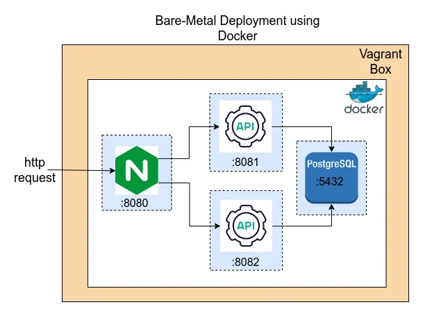

# Screenshots

This folder contains visual documentation of the Stanford Students API project.

## Recommended Screenshots to Include:

### 1. Web Interface
- `01-homepage.png` - Main dashboard with student list

- `02-add-student-form.png` - Add new student form

- `03-edit-student.png` - Edit student functionality

- `04-student-table.png` - Complete student table view

### 2. API Testing
- `05-postman-collection.png` - Postman collection overview

- `06-api-create-student.png` - POST request creating student

- `07-api-get-students.png` - GET request retrieving students
- `08-api-health-check.png` - Health check endpoint response

### 3. Database
- `09-database-schema.png` - PostgreSQL table structure

- `10-database-data.png` - Sample data in database

### 4. Development
- `11-project-structure.png` - File/folder organization
- `12-docker-build.png` - Docker build process

- `13-application-logs.png` - Server logs showing requests

### 5. Architecture
- `14-architecture-diagram.png` - System architecture overview

- `15-api-documentation.png` - API endpoints documentation

## File Naming Convention:
- Use descriptive names with numbers for ordering
- Format: `##-description.png`
- Keep file sizes reasonable (< 2MB each)
- Use PNG format for screenshots
- Use JPG for photos/diagrams

## Usage:
These screenshots will be used in:
- README.md documentation
- LinkedIn posts
- Portfolio presentations
- Project demonstrations